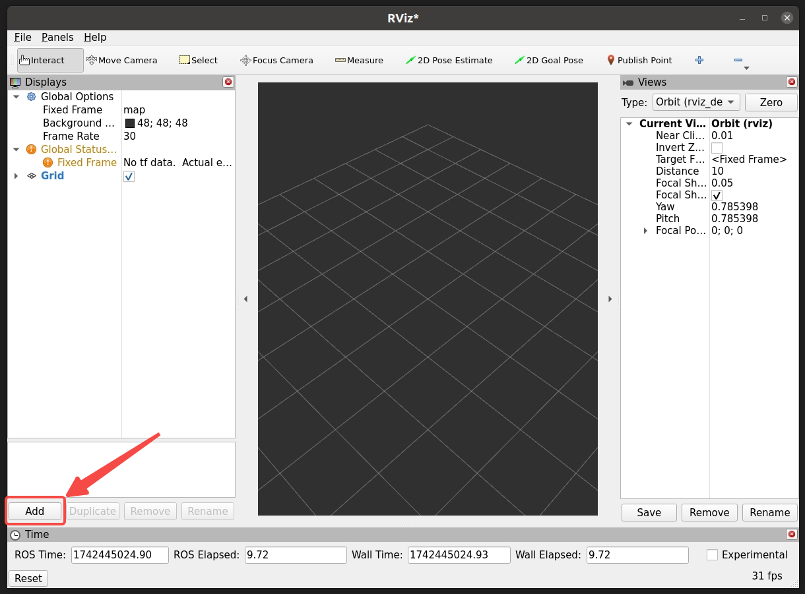
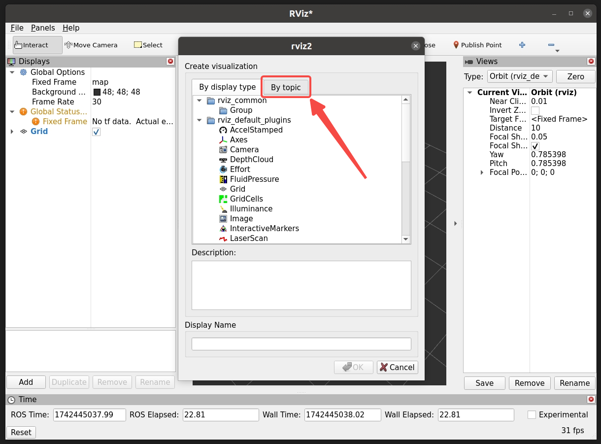
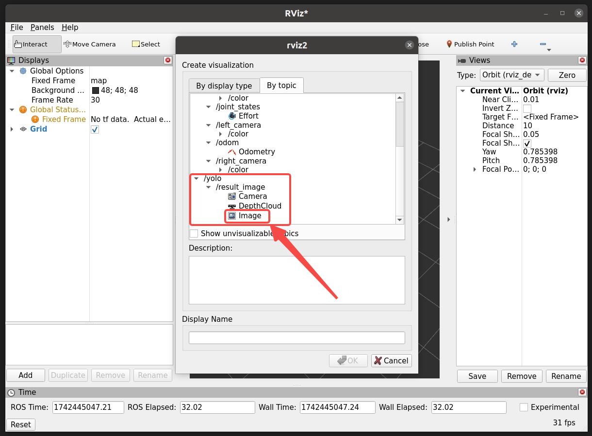
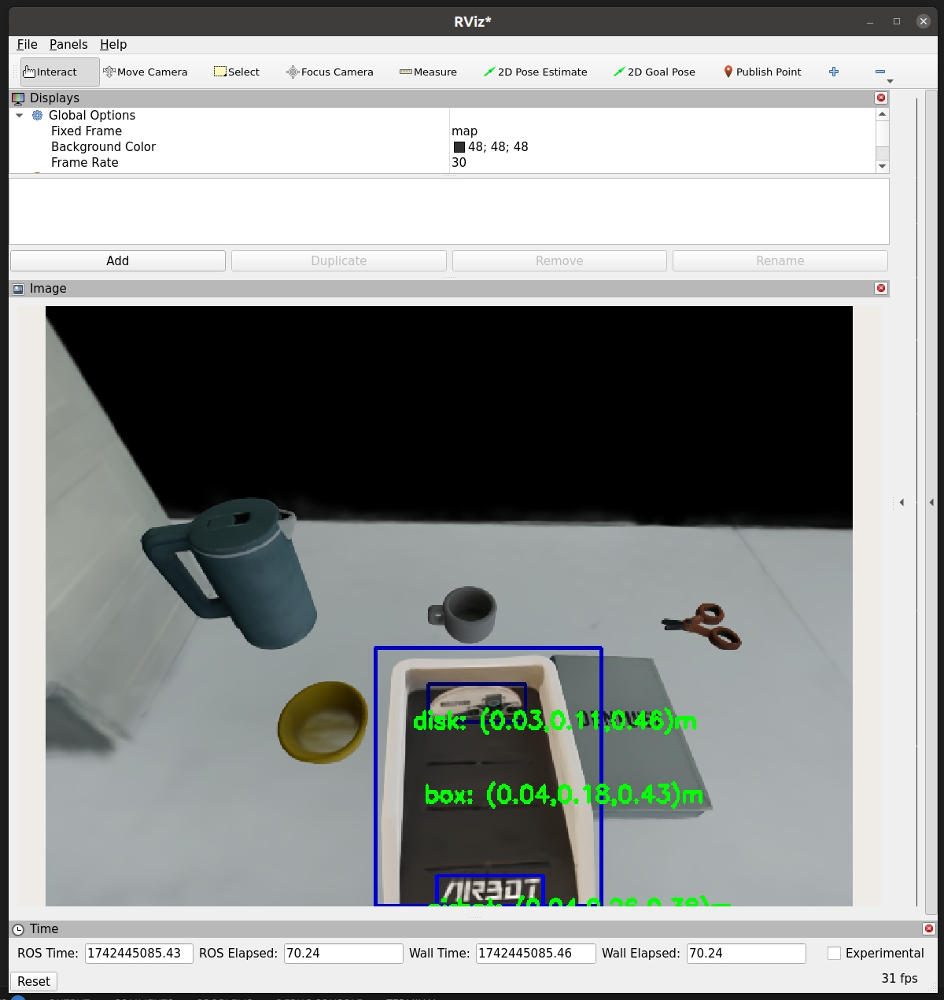

本仓库为s2r2025比赛的baseline，使用传统机器人算法实现，目标检测使用yolo。

## 更新说明

### 4.11

tag更新至v1.5：
1. mujoco版本更新v3.2.7 --> v3.3.0 增强了数值稳定性
2. 修正了gadgets的名称：wood -> plate
3. 修正了桌面的碰撞系数，增强了数值稳定性

## 操作说明

请更新server镜像至最新版本

```bash
docker pull discoverse/s2r2025_server:v1.5
(tag以最近版本为准，>=v1.5)
```

下载镜像

```bash
docker pull discoverse/s2r2025_client:baseline_yolo_v1
```

启动比赛

```bash
(terminal 1)
cd SIM2REAL-2025/scripts
# 修改 create_container_server.sh line15, 镜像名和tag tag以最新版本为准
# discoverse/s2r2025_server:v1.4 bash
bash create_container_server.sh
bash exec_server.sh
cd /workspace/SIM2REAL-2025/s2r2025
python3 s2r_server.py --round_id 1 --random_seed 99
# baseline 需运行时需指定 random_seed=99, 选手需参考baseline自行实现算法，在任意random_seed下完成任务
# 若比赛启动后60s内无收到指令，裁判机会判定比赛提前结束，重启即可
```

启动baseline

```bash
(terminal 2)
cd SIM2REAL-2025/scripts
# 修改 create_container_client.sh line5
# docker run -id --name s2r2025_client_baseline_yolo --gpus all \
# line14 镜像名和tag
# discoverse/s2r2025_client:baseline_yolo_v1 bash
bash create_container_client.sh

# 进入docker
docker exec -it s2r2025_client_baseline_yolo bash
cd /workspace/s2r2025_baseline_yolo
python3 baselin_round1_seed99.py

# 打开rviz2可视化yolo识别结果
(terminal 2)
xhost +
docker exec -it s2r2025_client_baseline_yolo bash
rviz2
```








